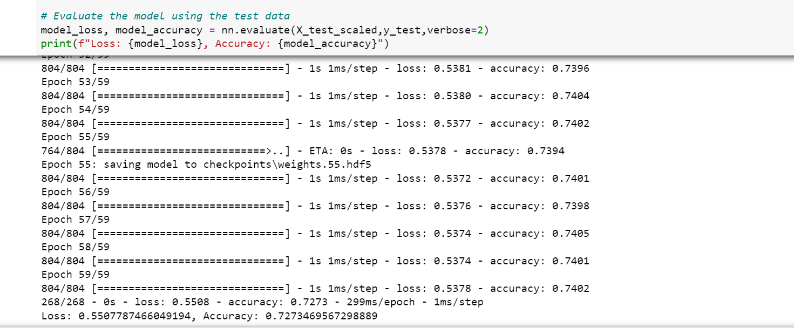

# Neural_Network_Charity_Analysis
Neural Network Charity Analysis

## Purpose of the Analysis:

Purpose of this analysis is to create a binary classifier that is capable of predicting whether applicants will be successful if funded by Alphabet Soup.

Tools:

Neural Network and Deep Learning libraries: sklearn

## Data Source:

A CSV (charity_data.csv) containing more than 34,000 organizations that have received funding from Alphabet Soup over the years. Within this dataset are a number of columns that capture metadata about each organization, such as the following:

- EIN and NAME—Identification columns
- APPLICATION_TYPE—Alphabet Soup application type
- AFFILIATION—Affiliated sector of industry
- CLASSIFICATION—Government organization classification
- USE_CASE—Use case for funding
- ORGANIZATION—Organization type
- STATUS—Active status
- INCOME_AMT—Income classification
- SPECIAL_CONSIDERATIONS—Special consideration for application
- ASK_AMT—Funding amount requested
- IS_SUCCESSFUL—Was the money used effectively

## Results:

Data Preprocessing:

- IS_SUCCESSFUL—Was is considered the target(s) for your model.
- APPLICATION_TYPE, AFFILIATION, CLASSIFICATION, USE_CASE, ORGANIZATION, STATUS—Active, INCOME_AMT, SPECIAL_CONSIDERATIONS, ASK_AMT are considered to be the features of this model.
- EIN and NAME variables are neither targets nor features and should be removed from the input data.

Compiling, Training, and Evaluating the Model:

Three hidden layers and one outer layer was selected for this model.  For the outer layer "sigmoid" activation was selected and for the hidden layers "relu" activation function was selected initially.  During one of the attempts activation was changed to "tanh" for the first hidden layer since I had a wide dataset.

## Model Optimization:

Adjusting the input data to ensure that there are no variables or outliers that are causing confusion in the model, such as:
- Reduced the number of columns to Application Type
- Adding more neurons to a hidden layers.
- One additional hidden layer was added, making it to total of 3 hiddenlayers.
- Changed the activation function from "relu" to "tanh" for the firs hidden layer.
- Number of epochs was increased from 100 to 120 

However, the accuracy of the model increased only slightly.

Recommendations:

RandomForestClassifier model could be used to determine if we can achieve better results.